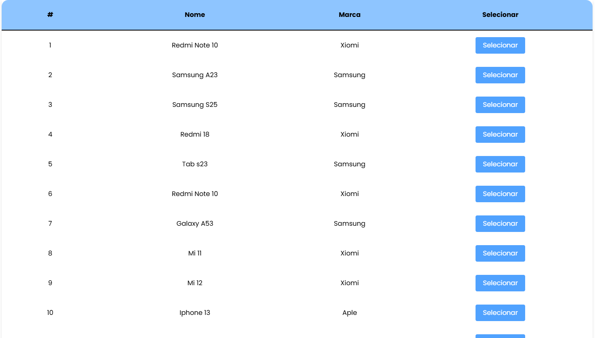
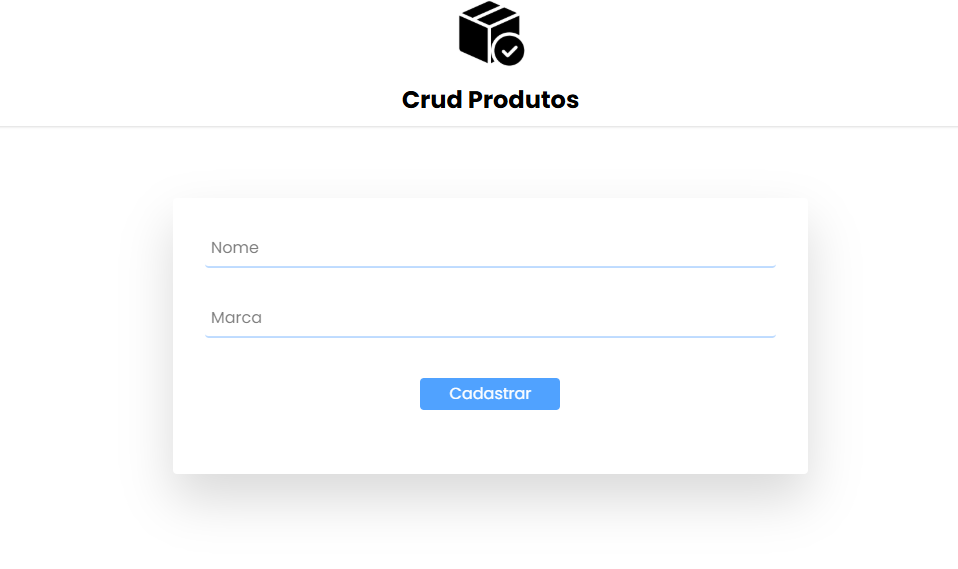
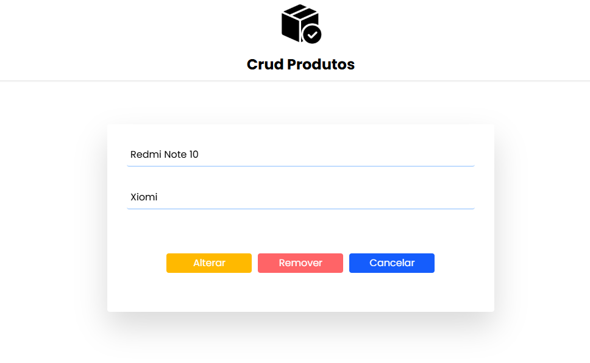

# 📦 CrudProdutos

Um sistema web de cadastro, edição, remoção e listagem de produtos — desenvolvido como projeto de aprendizado para reforçar conceitos de frontend e backend integrados.

## 🚀 Tecnologias utilizadas

- ⚛️ React (Frontend)
- ☕ Spring Boot (Backend)

## 🎯 Objetivo

Este projeto foi desenvolvido com foco no aprimoramento de habilidades técnicas, especialmente na integração entre frontend React e backend Java com Spring Boot.

## 🔧 Funcionalidades

- Cadastrar um novo produto
- Listar todos os produtos
- Editar dados de um produto existente
- Remover produtos

## 📌 Status do projeto

✅ Finalizado

## 👨‍💻 Sobre o desenvolvimento

Projeto individual com foco em consolidar conhecimentos de aplicações fullstack. O principal destaque está na comunicação entre o frontend React e uma API REST desenvolvida em Spring Boot.

## 🖼️ Imagens do sistema

### 📋 Tela de listagem de produtos

### 📝 Tela de cadastro de produto

### ✏️ Tela de edição de produto

